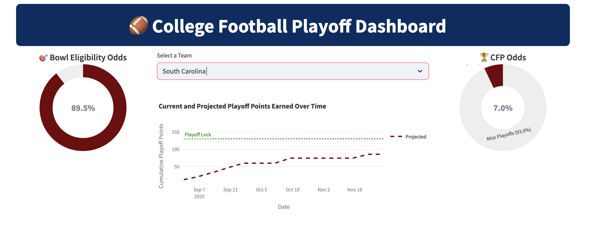
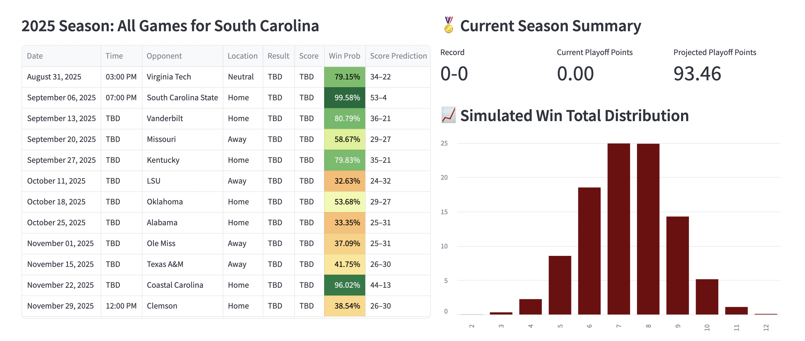
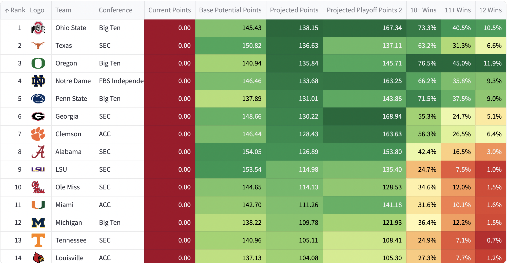
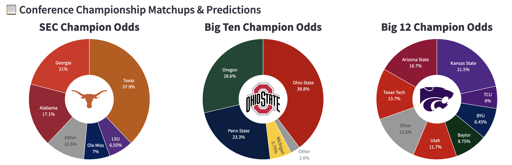
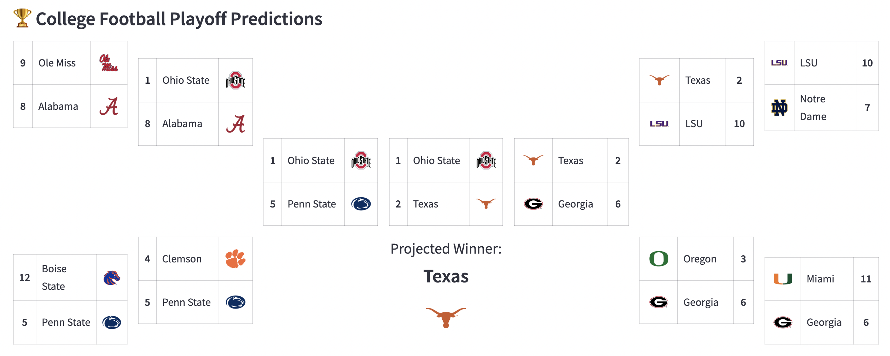

# BG.Analytics Dashboard

This is the advancement of the South Carolina Football Predictor. The project was created before the start of the 2025 season and was posted to @BG.Analytics on Instagram. A College Football Dashboard created to predict games and season outcomes. Utilizes a created metric "Playoff Points" to predict College Football Playoff seeding and champions.

# Explanation and Usage:

The Dashboard has many pages each with different uses: 
  1. Single Team Outlook:
This section shows the upcoming season schedule for any given FBS team and shows win total probabilities and post-season outlooks. This was mainly used for upcoming season outlooks and tracking how many wins each team is expected to get throughout the season. This automatically updates as games are played.
Example:

- 

  2. League Projections:
Here we display the team rankings in Playoff Points and show projected Playoff Points to track the College Football Playoff race for the current season. We can also display team probabilities of winning 10+, 11+, or 12 games in the season. This also automatically updates as games are played.
Example:
- 

  3. Season Simulation:
The Season Simulation section simulates the entire CFB season 1000 times and displays postseason expectations like conference championships and playoff projections.
Example:
- 
- 

  4. Various Others:
There are various other pages I created on here that I don't use for posts. One page shows most important matchups for the College Football Playoffs by week, another shows historical Playoff Point data for validation on the Playoff Points formula. 
