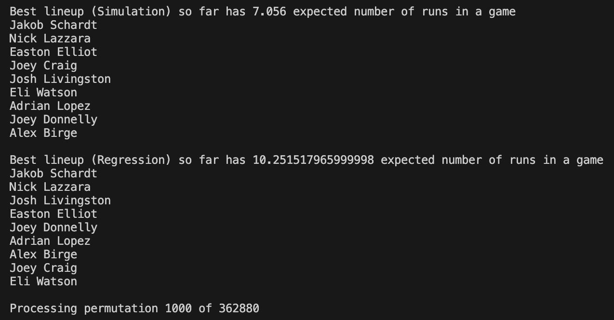

# Brennan Gillgrist Data Analytics Portfolio

Welcome to my portfolio! Here you will find details on my data analytics projects throughout my career.

## Projects

  
[Bayesian Linear Regression Project](bayesian-regression/README.md)

  A Bayesian logistic regression model predicting the win percentage of NFL teams from cap space management.
  
  - [Project Report](bayesian-regression/Project.Report)
  - [Project Summary](bayesian-regression/Project.Summary)

  
[TrackMan Data Analysis Tool](trackman-analysis/README.md)

  An R Shiny app for analyzing baseball TrackMan data.
  
  - [R Code](trackman-analysis/TrackMan.Analysis.Snippet.R)
  - 
  - 
  - 
  - 
  - 

  
[Baseball Lineup Optimization Tool](lineup-optimization/README.md)

  A simulation and regression tool for finding the optimal baseball lineup given key stats.
  
  - [Python Code](lineup-optimization/Lineup.Opt.Snippet.py)
  - 

## About Me
I am a senior statistics major at the University of South Carolina graduating in December of 2024. I have had multiple internships in baseball analytics with the Tampa Bay Rays and the Arroyo Seco Saints. More information about my career so far can be found in my resume below: 

[Download my Resume](assets/Brennan Gillgrist Resume.pdf)
